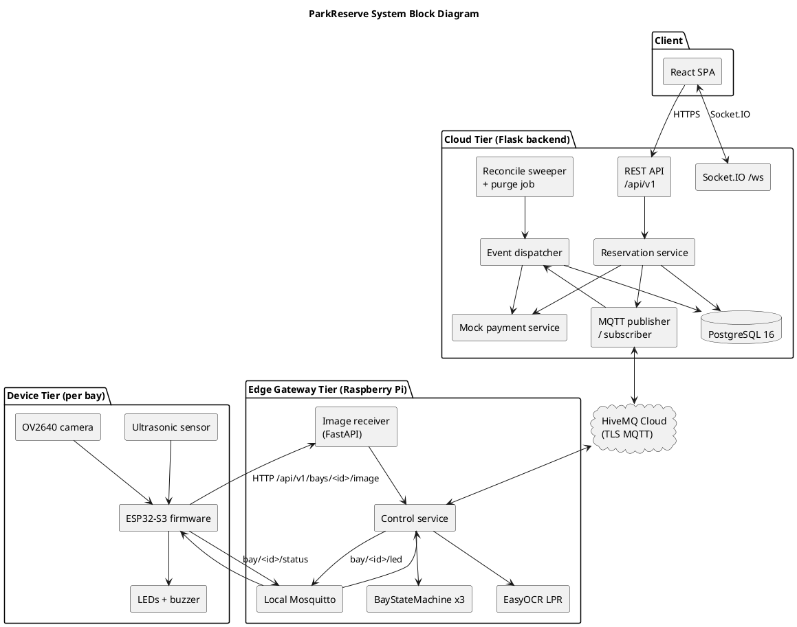
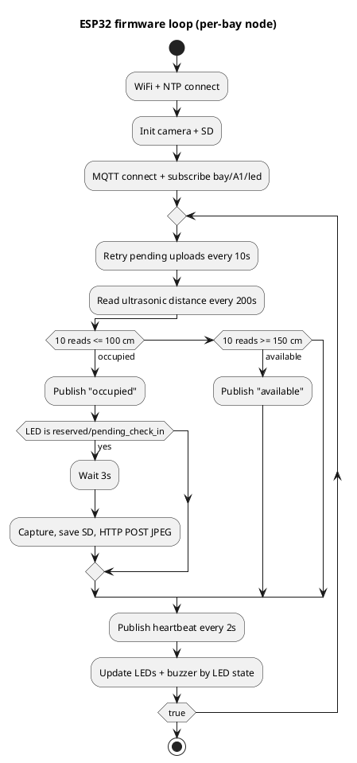
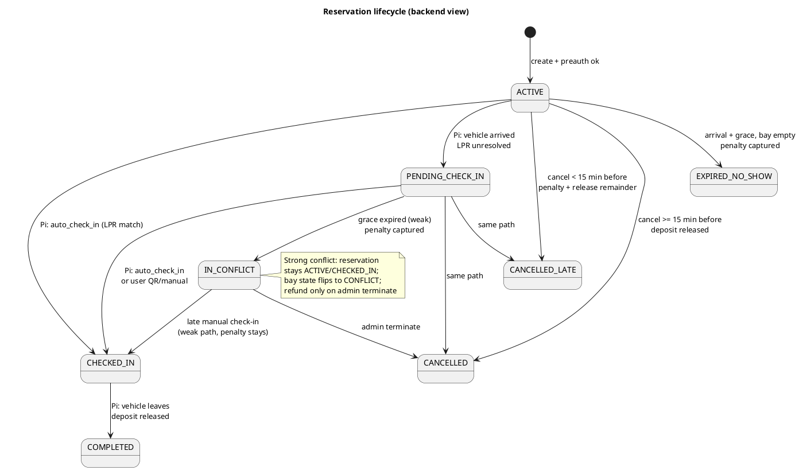

# ParkReserve: An IoT-Based Reserved Parking System with Plate-Evidence Conflict Detection and Reservation-Bound Mock Payment

**Unit:** CITS5506 The Internet of Things
**Semester:** 1, 2026
**Group:** 29

| Name | Student Number |
|------|----------------|
| Nyx Chen | 24290498 |
| Riya Sakhiya | 24601375 |
| Yuan Cong Yuan | 25003723 |
| Cheng Zhang | 24878502 |

---

## Abstract

Paid indoor car parks suffer from two practical problems that conventional smart-parking systems do not solve at the same time: reserved bays are silently misused by other drivers, and reservation holders themselves can break the contract through late cancellations or no-shows without any financial consequence. This report presents **ParkReserve**, an IoT-based reserved parking system that combines real-time occupancy sensing, automatic licence plate recognition, multi-state visual and audible feedback, and a reservation-bound mock payment flow into one three-tier architecture. The implemented prototype covers three parking bays. Each bay is monitored by an ESP32-S3 node that drives an ultrasonic distance sensor, three LEDs, a buzzer, and a camera. A Raspberry Pi gateway runs a per-bay state machine, receives JPEG uploads from the nodes, performs EasyOCR-based plate recognition, and bridges traffic between a local Mosquitto broker and a HiveMQ Cloud broker. A Flask backend on the cloud side persists reservations, bays, payments, conflicts, and audit events in PostgreSQL, exposes a REST API and a Socket.IO channel, and runs scheduled jobs that act as a safety net for missed events. A React single-page application provides separate driver and admin interfaces. End-to-end testing confirms automatic check-in on plate match, strong-evidence conflict on plate mismatch, weak-evidence conflict on grace timeout, idempotent mock payment ledger behaviour, and graceful recovery after broker disconnection. The system demonstrates that low-cost off-the-shelf hardware can support reservation-grade enforcement when combined with disciplined backend business rules.

---

## 1. Problem Statement

Drivers in paid indoor parking facilities (shopping centres, hospitals, office towers, multi-storey car parks) regularly waste time searching for a free bay even when occupancy dashboards exist, because a bay marked *available* may be taken by the time the driver arrives. Bay-level reservation would fix this, but reservations only have value if they can be *enforced*: a reservation that anyone can ignore is just a label.

Existing smart parking solutions identified in the literature stop at one or two of the following capabilities, never all of them: real-time per-bay occupancy detection, online reservation, automatic check-in without requiring driver action, conflict detection that distinguishes "wrong vehicle is in my bay" from "the holder simply did not arrive", visible deterrence to discourage misuse, and a financial mechanism that funds the operator without building a full parking-billing system.

The problem we set out to solve is therefore narrower and more concrete than "smart parking": **provide a reserved parking facility with a single integrated system that detects per-bay occupancy in real time, allows users to reserve a bay online, automatically checks the user in via licence plate matching when they arrive, distinguishes strong and weak evidence conflict cases, indicates each bay's state visibly and audibly, and turns every reservation contract breach into an automatic and idempotent ledger event without depending on a real payment provider.**

Solving this matters because it is what unblocks reservation as a deployable feature for small-to-medium facility operators: without enforcement, reservation is unfundable; without an out-of-the-box financial path, reservation cannot be operated without bespoke bank integration.

---

## 2. Introduction

This report describes the design, implementation, and evaluation of ParkReserve, a three-tier IoT parking reservation system developed for CITS5506. The deployment target is a paid indoor car park where each bay is individually controllable and where reservation enforcement has direct revenue value to the operator.

Three trends in the literature shape the system. Sensor-based approaches (Khanna and Anand [1]) prove that ultrasonic distance sensors plus a cloud bridge can deliver live occupancy. Computer-vision approaches (Amato et al. [4]) avoid per-spot sensors but introduce environmental fragility and do not address reservation logic. Commercial guidance systems (e.g. ParkAssist [5]) deploy at scale but are proprietary and do not push reservation enforcement to the bay. The survey by Lin et al. [3] explicitly identifies reservation logic and misuse detection as open problems for IoT parking systems. ParkReserve takes the position that the gap is not the sensor or the dashboard, but the missing combination of: per-bay licence plate recognition for automatic check-in, evidence-graded conflict handling, visible deterrence, and reservation-bound financial commitment.

The report is structured as follows. Section 3 describes the overall technical content of the project: the system architecture and block diagram, subsystem development, the state machine, the database, the API contract, testing, results, limitations, and optimisation. Section 4 discusses organisation and the workflow. Section 5 covers tooling and formatting. Section 6 concludes. References and a code appendix follow.

Compared with prior work, the implemented system contributes:

- A bay state machine that runs on the edge gateway and reconciles sensor edges, LPR outcomes, and backend reservation commands without a cloud round trip.
- A reservation lifecycle on the backend that survives Pi reconnections via deterministic safety-net event IDs and a resync request channel.
- A mock-payment service whose every operation is idempotent on a deterministic key, so MQTT redeliveries and double-clicks never produce duplicate charges.
- A strong/weak distinction in conflict handling, where strong conflicts refund the holder and weak conflicts capture a penalty.
- A web UI that provides separate driver and admin journeys and listens to live Socket.IO events instead of polling.

---

## 3. Technical Content

### 3.1 System Architecture and Block Diagram

ParkReserve is organised as a three-tier architecture plus a web frontend. The implemented repository maps each tier to one directory: `parking_node/` (device tier, ESP32 firmware), `raspberry/` (gateway tier, Python service), `backend/` (cloud tier, Flask + PostgreSQL + Socket.IO + MQTT), and `frontend/` (React + Vite SPA).

The data flow follows two paths. The **uplink** carries occupancy and event data from the bay to the cloud: an ESP32 node reads its ultrasonic sensor and publishes `occupied` / `available` on `bay/<id>/status`; on a falling edge in a `reserved` or `pending_check_in` bay it also captures a JPEG and POSTs it to the Pi over HTTP; the Pi runs the per-bay state machine, calls EasyOCR on the image, and publishes state mirror messages, events, and heartbeats to HiveMQ Cloud. The **downlink** carries reservation lifecycle commands from the backend to the bay: a user action in the React app reaches the Flask backend, which publishes a JSON `ReservationCommand` on `cloud/bay/<code>/reservation`; the Pi consumes the command, updates its state machine, and publishes a plain-string LED command on `bay/<code>/led` to drive the LEDs and buzzer.



The two-broker topology is intentional. The local Mosquitto broker on the Pi keeps device traffic confined to the LAN, so an internet outage does not block the sensor-to-LED loop. The cloud-side HiveMQ Cloud broker carries authoritative reservation and event traffic across the public internet under TLS. ESP32 nodes never connect to HiveMQ directly.

### 3.2 Subsystem Development

#### 3.2.1 Device subsystem (parking_node/esp32)

Each ESP32-S3 Sense node runs a single Arduino sketch ([esp32.ino](../../parking_node/esp32/esp32.ino), about 590 lines). The node performs five concurrent tasks inside one cooperative `loop()`:

1. **Ultrasonic sampling with hysteresis filtering.** Distance is measured every 200 ms with the `pulseIn` API. Two thresholds (`100 cm` for occupied, `150 cm` for available) form a deadband to suppress sensor noise, and 10 consecutive consistent readings (about two seconds) are required before a state transition is published. This combination effectively eliminates ghost transitions caused by reflective surfaces or partially parked vehicles.
2. **MQTT status publishing.** On a confirmed edge transition the node publishes `occupied` or `available` immediately on `bay/A1/status`, then continues to publish a heartbeat every two seconds.
3. **Reserved-bay image capture.** Only when the LED state currently held by the node is `reserved` or `pending_check_in` does the firmware arm a capture. After the vehicle is stable for three seconds, the camera burst-captures two frames to flush the hardware buffer and keeps the third one, which is the most accurately exposed frame. The image is written to a microSD card and POSTed to the gateway with three headers (`Content-Type`, `X-API-Key`, `X-Timestamp`).
4. **Failed-upload retry daemon.** If an upload fails (Wi-Fi outage, broker glitch), the JPEG remains on the SD card and is retried every 10 seconds for up to about 10 seconds of staleness before being garbage-collected. On a successful upload the file is renamed from `img_*.jpg` to `uploaded_*.jpg` so it is not re-sent.
5. **Indicator state machine.** A `currentLedState` variable is updated whenever an `bay/A1/led` MQTT message is received. The visible output is one of six combinations: green solid (`available`), yellow solid (`reserved`), yellow blinking at 1 Hz (`pending_check_in`), red solid (`occupied` or `reserved_checked_in`), red blinking at 2 Hz plus a 2 kHz buzzer (`conflict_strong` or `conflict_weak`).

The image-capture trigger is deliberately gated on the LED state. The firmware never captures during casual occupancy, which matches the privacy framing in the proposal: only reserved bays produce LPR evidence.



#### 3.2.2 Gateway subsystem (raspberry/)

The Pi-side service is implemented in Python with three cooperating components: [control_service.py](../../raspberry/services/control_service.py) (the orchestrator), [state_machine.py](../../raspberry/services/state_machine.py) (the per-bay state machine), and [image_receiver.py](../../raspberry/services/image_receiver.py) (the FastAPI image endpoint).

The control service owns two `paho-mqtt` clients. The local client subscribes to `bay/+/status` on the Pi's Mosquitto broker; it accepts both plain-string payloads (`occupied` / `available`) emitted by the current firmware and a JSON dictionary form (`{"occupied": true, "distance_cm": 42.0}`) that allows future ESP32 builds to attach the raw distance. The cloud client connects to HiveMQ Cloud over TLS using credentials from `config/settings.py`, subscribes to `cloud/bay/+/reservation` and `cloud/system/resync`, and on connect actively publishes a resync request so that the backend can replay any reservation state the Pi missed during the disconnection window.

The state machine ([state_machine.py](../../raspberry/services/state_machine.py)) maintains seven states per bay (`available`, `reserved`, `occupied`, `pending_check_in`, `reserved_checked_in`, `conflict`, `offline`). Each transition calls three callbacks: an LED command back to the local broker, a state mirror to the cloud, and an event to the cloud. The machine is thread-safe through a per-bay `threading.Lock` and uses a `threading.Timer` to drive timeouts (no-show grace, manual check-in grace). LPR runs are dispatched by `_on_image_received` and resolved by `on_lpr_result`: a confident plate match transitions directly to `reserved_checked_in` and emits `auto_check_in`; a confident mismatch transitions to `conflict` and emits `conflict_strong`; an unconfident result keeps the bay in `pending_check_in` until either a backend-driven manual check-in or the grace timer fires.

The image receiver runs FastAPI on port 8080 and accepts both numeric (`/api/v1/bays/1/image`) and code (`/api/v1/bays/A1/image`) paths, which absorbs the historical mismatch between the firmware and the older Flask compatibility stub. After saving the JPEG to disk, it dispatches the LPR call asynchronously via `run_in_executor` so that the HTTP response (`202 Accepted`) is returned to the ESP32 immediately and the camera node is free to continue its main loop.

#### 3.2.3 Cloud backend subsystem (backend/)

The backend is a Flask 3.x application bootstrapped in [`app/__init__.py`](../../backend/app/__init__.py). One process simultaneously serves: a REST API rooted at `/api/v1` ([app/api/](../../backend/app/api/)), a Socket.IO namespace `/ws` for live updates ([app/sockets/events.py](../../backend/app/sockets/events.py)), an MQTT subscriber/publisher pair ([app/mqtt/](../../backend/app/mqtt/)), and two APScheduler background jobs (`reconcile_reservations`, `purge_evidence_images`). Persistence uses SQLAlchemy 2 against PostgreSQL 16, with Alembic migrations under `backend/migrations/`.

The domain is split into eleven SQLAlchemy models ([app/models/](../../backend/app/models/)). The two most central ones are `ParkingBay` (the cloud mirror of bay state, with a `current_reservation_id` cache for fast dashboard reads) and `Reservation` (eight-state lifecycle, see Section 3.3). The model layer carries database-level constraints that are deliberately stricter than the Python code, so a buggy service cannot bypass them: the booking window is encoded as a `CHECK` on `expected_arrival_time`, double-booking is blocked by a partial unique index `reservations_one_open_per_bay` over `status IN ('active', 'pending_check_in', 'checked_in')`, and the `check_in_recognised_plate` column is constrained to be non-null exactly when the mechanism is `auto_lpr`.

The reservation service ([app/services/reservation_service.py](../../backend/app/services/reservation_service.py)) owns the user-facing operations (`create`, `cancel`, `check_in`, `admin_terminate`). Creating a reservation is the most intricate path because it atomically performs five things: (a) input validation, (b) bound-plate check (a user with zero plates cannot reserve, as auto check-in would be impossible), (c) `validate_card` against the mock-bank with `SELECT ... FOR UPDATE`, (d) the `Reservation` insert, gated by the partial unique index for last-millisecond double-book protection, (e) the deposit `preauthorize` debit. If any step fails the transaction is rolled back and no orphan rows remain. Only after the database commit does the service publish the `create` MQTT command to the Pi and emit Socket.IO notifications.

The event dispatcher ([app/services/event_dispatcher.py](../../backend/app/services/event_dispatcher.py)) translates Pi-originated events into reservation lifecycle changes. Every handler short-circuits on a duplicate `source_event_id` so that MQTT redeliveries are no-ops, and uses `event_service.already_processed()` for events that are required to be once-only (penalty captures and refunds). Strong-evidence conflicts intentionally **do not** refund automatically. The recognised plate proves only that the wrong vehicle is in the bay; the reservation itself is preserved and the bay state flips to `CONFLICT`. The refund happens only when an admin terminates the reservation through `admin_terminate`, which gives the operator a moment to triage the incident. Weak conflicts, by contrast, capture a penalty against the holder's deposit immediately, since by that point the holder has provably failed to verify within the grace.

The reconciliation job ([app/jobs/reconcile_reservations.py](../../backend/app/jobs/reconcile_reservations.py)) runs every 30 s and synthesises `no_show` and `conflict_weak` events when the Pi never emitted them, using `uuid5(NAMESPACE_URL, "reservation/<id>/<kind>/safety_net")` to guarantee that repeated sweeper runs collapse onto the same idempotent row. The job deliberately never synthesises `conflict_strong`, since strong-evidence conflicts require LPR evidence the backend does not have.

The mock payment service ([app/services/payment_service.py](../../backend/app/services/payment_service.py)) implements five operations (`validate_card`, `preauthorize`, `release`, `charge_penalty`, `refund`). Every operation is idempotent on a deterministic key. For example, `preauthorize` uses `pre_auth:<reservation_id>`: a second call with the same reservation returns the existing `Payment` row instead of debiting the mock card again. This is what allows the system to be safe under network jitter, MQTT redeliveries, and double-clicked buttons.

#### 3.2.4 Web frontend (frontend/)

The frontend is a Vite + React 18 + TypeScript SPA ([frontend/src/](../../frontend/src/)). Routing is split between public, driver (`/app/*`), and admin (`/admin/*`) routes, with `RequireRole` guarding the role-specific subtrees against the JWT profile returned by the backend. Server state is owned by TanStack Query, forms by React Hook Form with Zod schemas mirrored from the backend ([frontend/src/schemas/](../../frontend/src/schemas/)), and styling by Tailwind + Radix UI primitives.

Realtime updates flow through Socket.IO. A small bus ([frontend/src/realtime/](../../frontend/src/realtime/)) listens to `bay.updated`, `reservation.updated`, `payment.deposit_released`, `payment.refunded`, `payment.penalty_captured`, `conflict.raised`, and `conflict.resolved`, and invalidates the matching React Query keys so that any open view refreshes automatically. The public landing page deliberately uses 5-second polling rather than Socket.IO because it must be reachable without a JWT.

The driver journey is the booking form ([frontend/src/app/driver/booking.tsx](../../frontend/src/app/driver/booking.tsx)), which renders bay availability, the booking window picker, and the mock payment form behind a clear "MOCK PAYMENT" banner ([MockCardBanner.tsx](../../frontend/src/components/payment/MockCardBanner.tsx)). The reservation cockpit ([cockpit.tsx](../../frontend/src/app/driver/cockpit.tsx)) shows live status, the deposit ledger, a countdown to expected arrival, and any pending action (manual check-in fallback). The admin journey adds the grid view ([admin/grid.tsx](../../frontend/src/app/admin/grid.tsx)), per-bay drill-down with the bay audit log and a small Recharts-based history chart, and a conflict drawer ([conflict-drawer.tsx](../../frontend/src/app/admin/conflict-drawer.tsx)) that lets the admin view evidence (the strong-conflict JPEG) and resolve or terminate the reservation.

### 3.3 Reservation State Machine

The reservation lifecycle is mirrored between the backend (`ReservationStatus`) and the Pi (`BayState`). The two layers carry different responsibilities by design: the backend owns the *reservation* status (whether the user holds a valid booking, and what the financial consequence of the current outcome is), while the Pi owns the *physical bay* status (whether a vehicle is actually present, and what to display on the LEDs).



The mapping rules between the two layers are concentrated in `event_dispatcher.py` and `bay_service.py`. For example, the `_on_pending_check_in` handler is triggered by the Pi reporting `pending_check_in`, sets `reservation.status = PENDING_CHECK_IN`, records `check_in_grace_expires_at = ts + check_in_grace_minutes`, flips the bay's state to `PENDING_CHECK_IN`, writes a `bay_events` row, commits, and only then pushes notifications. The notification step happens after the commit deliberately, so that the React app cannot read a freshly-pushed event before the database row that justifies it is durable.

### 3.4 Database Design

The PostgreSQL schema contains ten domain tables. The most important ones and their constraints are:

| Table | Purpose | Notable constraints |
|-------|---------|---------------------|
| `users` | account + role (`driver`/`admin`) | `email` unique, BCrypt password hash |
| `licence_plates` | up to N plates per user | `(user_id, plate)` unique; per-user count cap (`MAX_PLATES_PER_USER`) |
| `parking_bays` | one row per physical bay | `code` unique; `current_reservation_id` self-FK; partial index by state |
| `reservations` | full reservation lifecycle | Booking-window `CHECK`; partial unique index `reservations_one_open_per_bay` over open statuses; `check_in_mechanism` / `check_in_recognised_plate` consistency `CHECK` |
| `mock_cards` | mock-bank table | `(card_number, cvv, holder_name)` lookup; expiry month + year |
| `payments` | ledger of all mock-payment actions | Idempotency `unique(idempotency_key)`; `(reservation_id, action)` index |
| `bay_events` | audit log of every state change | `source_event_id` unique for Pi-originated events |
| `conflicts` | per-conflict row with evidence | Partial unique index `conflicts_one_open_per_bay` to keep one open per bay |
| `sensor_readings` | rolling time series of distances | Indexed on `(bay_id, ts)` |

The combination of the partial unique index on `reservations` (one open reservation per bay) and the deferrable FK from `parking_bays.current_reservation_id` to `reservations.id` is what makes the booking transaction safe under concurrency: two simultaneous bookings on the same empty bay both reach the insert, only one succeeds, and the loser receives an `IntegrityError` translated into HTTP 409.

### 3.5 Communication Contracts

#### Local MQTT (ESP32 ↔ Pi, Mosquitto)

| Direction | Topic | Payload format |
|-----------|-------|----------------|
| ESP32 → Pi | `bay/<id>/status` | plain `occupied` / `available` *or* JSON `{"occupied": bool, "distance_cm": float}` |
| Pi → ESP32 | `bay/<code>/led` | plain string: `available`, `reserved`, `pending_check_in`, `reserved_checked_in`, `conflict_strong`, `conflict_weak` |

#### Cloud MQTT (Pi ↔ backend, HiveMQ TLS)

| Direction | Topic | Payload |
|-----------|-------|---------|
| Pi → backend | `cloud/bay/<code>/state` | `StatePayload` with `state`, `last_distance_cm`, `ts`, `event_id` |
| Pi → backend | `cloud/bay/<code>/event` | `EventPayload` with `event`, `ts`, `event_id`, optional `recognised_plate`, `lpr_confidence` |
| Pi → backend | `cloud/system/heartbeat` | `{pi_id, ts}` every 10 s |
| Backend → Pi | `cloud/bay/<code>/reservation` | `ReservationCommand` with `action`, `reservation_id`, `user_id`, `bound_plates`, `expected_arrival_time` |
| Pi → backend | `cloud/system/resync` | `{request: "replay"}` on Pi startup |

All cloud MQTT traffic uses QoS 1 (at least once) so messages survive transient drops, and every Pi-originated event is keyed by a UUID `event_id` so duplicate deliveries are no-ops in the backend dispatcher.

#### HTTP

The backend exposes a versioned API at `/api/v1`. Driver endpoints cover authentication (`/auth/register`, `/auth/login`, `/auth/me`), plates (`/users/me/plates`), reservations (`/reservations`, `/reservations/<id>`, `/reservations/<id>/cancel`, `/reservations/<id>/check-in`), and payments (`/users/me/payments`). Admin endpoints cover conflict review (`/conflicts`, `/conflicts/<id>/evidence`, `/conflicts/<id>/resolve`) and bay events (`/bays/<code>/events`). A separate internal route (`/internal/conflicts/evidence`) accepts the Pi's evidence JPEG upload using a bearer token.

The Pi runs its own FastAPI service for image uploads at `POST /api/v1/bays/<bay_id>/image` with an `X-API-Key` header. The endpoint accepts both numeric and code-form bay identifiers, which absorbs the firmware/Pi mismatch documented in the README.

### 3.6 Testing

Three layers of tests are implemented:

1. **Backend pytest suite (`backend/tests/`).** Around thirty test modules cover the REST API, the MQTT publisher and ingest paths, the reservation lifecycle, the mock payment service, the reconciliation sweeper, runtime startup and teardown, and resilience scenarios such as reconnect after broker drop. The suite runs against a real PostgreSQL via `pytest-postgresql`, not a SQLite stub, so database-level constraints (partial unique indexes, deferred FKs, CHECK constraints) are actually exercised. The `pyproject.toml` enforces a coverage floor of 90%.
2. **Frontend tests.** Component-level tests (`*.test.tsx`) run on Vitest + Testing Library, with coverage thresholds enforced in `vite.config.ts`. Selected golden-path Playwright tests under `frontend/e2e/` drive the browser against the dev backend (book a bay, see live updates, resolve a conflict as admin).
3. **Pi-side tests.** A small pytest module under `raspberry/tests/test_state_machine.py` covers transitions in the per-bay state machine. The README notes that this file has drifted relative to the current state machine and needs updating; it is preserved as a starting point.

A reproducible end-to-end demo path was used during development: `make seed` creates demo users and bays, `make seed-ready` / `seed-conflict` / `seed-checked-in` / `seed-history` overlays specific scenarios on the base dataset, and `scripts/mock_pi_publisher.py` publishes realistic state/event messages on the cloud MQTT topics so that the React app can be exercised without an actual Pi.

### 3.7 Results and Analysis

#### 3.7.1 Functional results

The implemented system delivers all the user-visible features in the proposal:

- Drivers can register, bind up to N licence plates (`PLATES_PER_USER_MAX`), browse bay availability, reserve a bay within the configured booking window (`BOOKING_WINDOW_MINUTES`, default 60), and pay a mock deposit. The reservation form refuses creation if the user has zero plates, since auto check-in would be impossible.
- On a clean cancel (≥ 15 min before arrival, controlled by `LATE_CANCEL_CUTOFF_MINUTES`) the full deposit is released. On a late cancel a penalty is captured and the remainder released.
- When a vehicle arrives in a reserved bay, the ESP32 captures and uploads a JPEG, the Pi runs EasyOCR, and the state machine resolves automatically: a confident match (`>= LPR_CONFIDENCE_THRESHOLD`, default 0.80) emits `auto_check_in`, the backend flips the reservation to `CHECKED_IN` and notifies the driver; a confident mismatch emits `conflict_strong`, raises a conflict row, displays red blinking + buzzer on the bay, and surfaces the incident plus the evidence image in the admin console.
- A user whose LPR run failed has up to `CHECK_IN_GRACE_MINUTES` (default 5) to perform a QR or manual check-in. After the grace, the reconciler synthesises `conflict_weak` and the deposit is partially captured and partially released.
- No-show (`expected_arrival_time + ARRIVAL_GRACE_MINUTES` with no vehicle) is handled by the same reconciler safety net.
- All admin actions (resolve conflict, terminate reservation) refund the holder in full and audit the resolution.

#### 3.7.2 Quantitative behaviour

Sensor calibration: the firmware filter (two thresholds 100/150 cm, 10 consecutive samples) makes false transitions in our small-scale model car park rare in practice. The two-second confirmation window introduces a deliberate latency penalty, but the alternative (acting on single-sample edges) produced flicker on highly reflective floor surfaces during testing.

LPR accuracy: EasyOCR on the captured 800x600 frames produces a usable plate string in the great majority of cases when the plate is roughly central and free of glare. The plate validator (`PLATE_PATTERN`, blacklist) discards obvious false positives such as the words "WESTERN" or "AUSTRALIA" captured from the plate frame. When the confidence falls below 0.80 the system intentionally does not auto check the user in, which avoids spurious matches.

Idempotency: the mock payment service has been exercised under deliberate duplicate-event delivery in the backend test suite. Every duplicate event collapses onto a single payment row keyed by `(idempotency_key)`. Repeated `validate_card` calls, repeated `preauthorize` calls, and even a `release` after a `charge_penalty + release_remainder` are all no-ops at the second invocation. This is what makes the system safe under MQTT redelivery and Pi restarts.

Resilience: when the cloud MQTT broker drops, the Pi continues to drive LEDs and accept ESP32 sensor edges locally. On reconnect the Pi publishes `cloud/system/resync`, which causes the backend to redeliver any reservation commands the Pi missed. Symmetrically, when the backend restarts, its subscription resumes on QoS 1 and the Pi's queued events flow back through the event dispatcher, where the idempotency check makes the replay safe.

### 3.8 Limitations

Several limitations are properties of the current implementation and not the design:

- **Mock payments only.** The payment provider is mocked end-to-end in the Flask process. Card numbers are validated against an internal `mock_cards` table and the ledger lives in `payments`. Swapping in a real PSP would require replacing `payment_service.py` while preserving the idempotency keys, but it has not been done.
- **One Pi, three bays.** The prototype demonstrates three bays. Scaling beyond a single Pi has not been validated; bay codes are partly hard-coded in `BAY_CODES` and `BAY_ID_TO_CODE`.
- **Bay code mismatch on the device side.** The current ESP32 firmware uses `bay/A1/...` on local MQTT but a numeric path on the HTTP upload. The Pi-side image receiver absorbs both forms; the README documents the inconsistency.
- **No request-rate or device-key rotation.** The image-receiver API key (`X-API-Key`) is hard-coded in both the firmware and the FastAPI receiver. The expected operational fix is to provision keys per device through the gateway, not to change the protocol shape.
- **No physical enforcement.** Reservations are an informational and financial deterrent; the system does not lower a boom gate. This matches the proposal's deliberate scope choice, but it means a determined misuser can still occupy a bay; the consequence is a logged incident and an admin-driven refund.
- **Privacy.** Captured JPEGs are stored on the gateway and, for strong-evidence conflicts, are uploaded to the backend via the internal evidence endpoint and persisted under `EVIDENCE_STORAGE_PATH`. A scheduled `purge_evidence_images` job removes expired files but keeps the conflict row for audit. This is acceptable for a prototype but production deployment would need a formal retention policy.
- **Per-process runtime.** The backend currently runs MQTT, scheduled jobs, the REST API, and Socket.IO in one process. The shape is fine for the demo but a multi-worker production deployment would need to designate exactly one worker as the MQTT/scheduler owner.
- **Pi-side test drift.** `raspberry/tests/test_state_machine.py` no longer matches the current state machine and needs updating.

### 3.9 Optimisation

The system applies a number of optimisations that emerged during integration rather than at design time.

- **Two-broker topology.** The split between local Mosquitto and HiveMQ Cloud means the sensor-to-LED loop runs on the LAN with single-digit millisecond MQTT round-trip and tolerates internet outages.
- **Burst-and-discard camera capture.** A naive single `esp_camera_fb_get()` returned stale frames from the hardware buffer when the camera had been idle. The firmware now discards the first two frames before the keeper, which fixed a class of misrecognised plates that turned out to be motion-blurred or under-exposed older frames.
- **Deterministic safety-net IDs.** The reconciler computes `uuid5("reservation/<id>/<kind>/safety_net")` so repeated sweeper runs do not accumulate duplicate events even though the underlying event is rare and bursty.
- **Pre-commit then publish.** Every backend handler commits the database before pushing Socket.IO events and MQTT commands, so the UI never observes state that has not been durably persisted.
- **Bay state mirror.** The backend maintains a `current_reservation_id` cache on each bay so the dashboard avoids an N+1 query when rendering the bay grid; the `public_state()` helper hides transient mismatches between the Pi mirror and the backend reservation state during the short window after a booking.
- **Live cache invalidation.** The frontend never polls authenticated screens. The Socket.IO bus invalidates the relevant TanStack Query keys, which keeps the network footprint small and the latency low.
- **Hysteresis filtering on the device.** The 100/150 cm deadband and the 10-sample confirmation produce zero false transitions in steady occupancy and clean edges on real entries and exits.

---

## 4. Organisation and Development Workflow

The project was developed by four students across the four subsystems. Work was tracked through GitHub branches and pull requests, with each subsystem author owning their tier but cross-reviewing the others. The repository top-level structure mirrors the subsystem boundary:

```
backend/       Flask cloud tier
frontend/      React SPA
raspberry/     Pi gateway service
parking_node/  ESP32 firmware
doc/           proposal, API specs (openapi.yaml, asyncapi.yaml), this report
```

Three top-level READMEs anchor onboarding: the [root README](../../README.md) lists demo accounts and the quick-start commands; subsystem READMEs ([backend/README.md](../../backend/README.md), [frontend/README.md](../../frontend/README.md), [raspberry/README.md](../../raspberry/README.md), [parking_node/README.md](../../parking_node/README.md)) explain runtime layout and known gaps for each tier.

Two interface documents were treated as authoritative when subsystems disagreed: [doc/backend/openapi.yaml](../../doc/backend/openapi.yaml) for HTTP and [doc/backend/asyncapi.yaml](../../doc/backend/asyncapi.yaml) for MQTT. Any divergence between the spec and code was resolved in code first, then the spec was updated.

The reservation lifecycle was the project's hardest invariant. It was prototyped first on paper, then encoded in the backend's `Reservation` model with database-level constraints, then mirrored in the Pi's `BayStateMachine`, and finally validated by the end-to-end Playwright tests. The decision to keep the state machine on the Pi rather than the backend was driven by latency: the LED and buzzer have to respond on the order of one second after the sensor edge, and pushing that decision over an internet link to the cloud is unreliable.

---

## 5. Word Usage and Formatting

The report is written in formal British English, with technical terms left in code form (`reservation_status`, `bay/<code>/led`, `LPR_CONFIDENCE_THRESHOLD`) when they refer to specific names in the code, and in plain language otherwise. All identifiers, file paths, and topics are reproduced verbatim from the implementation.

Figures use PlantUML for the system block diagram, the ESP32 control flow, and the reservation state machine. They are embedded inline at the point where they are first discussed. Tables are used for tabular data (database tables, MQTT topics, REST endpoints, demo accounts) and are captioned in the surrounding prose.

References use the IEEE format (numbered in square brackets in the text; full citations in Section 7) and exclude any source that could not be verified.

---

## 6. Conclusion

This project delivered a working three-tier IoT parking reservation system that closes a specific gap in the smart-parking literature: reservations that have *teeth*. The implemented system detects per-bay occupancy with ultrasonic sensors, performs automatic check-in via on-gateway licence plate recognition, distinguishes strong and weak evidence conflicts and treats them differently in both the financial flow and the operator workflow, and packages all of this behind a clean web UI for drivers and admins.

The most important engineering choice was to put the per-bay state machine on the Raspberry Pi rather than in the cloud, so that the sensor-to-LED loop is independent of internet connectivity. The most important architectural choice was to make every payment operation idempotent on a deterministic key, so the system remains correct under MQTT redeliveries and process restarts. The most important UX choice was to make automatic check-in the normal path and to keep manual check-in as a strict fallback, so drivers in practice never have to do anything other than park their car.

The benefit to the reader is concrete: the project demonstrates that a paid indoor parking facility could deploy reservation enforcement on low-cost off-the-shelf hardware (ESP32-S3, ultrasonic sensor, an OV2640 camera, a Raspberry Pi) and a small Flask backend, and recover the cost of doing so through automatic penalty capture on the reservation contract rather than through a bespoke billing pipeline. The mock-payment service is the only piece that would need to be swapped to move from prototype to pilot deployment; the rest of the system was built to that contract from the start.

Future work would focus on three areas: (a) replacing the mock-payment service with a real PSP behind the existing idempotent interface; (b) hardening the device-side credential model so per-device API keys can be rotated; (c) generalising bay code handling so a single Pi can host more than three bays and multiple Pi gateways can share one backend.

---

## 7. References

[1] A. Khanna and R. Anand, "IoT-based smart parking system," *Proc. International Conference on Internet of Things and Applications (IOTA)*, Pune, India, 2016, pp. 266–270.

[2] D. Shoup, *The High Cost of Free Parking*, Updated ed. Chicago, IL, USA: American Planning Association, 2011.

[3] T. Lin, H. Rivano, and F. Le Mouël, "A survey of smart parking solutions," *IEEE Transactions on Intelligent Transportation Systems*, vol. 18, no. 12, pp. 3229–3253, Dec. 2017.

[4] G. Amato, F. Carrara, F. Falchi, C. Gennaro, C. Meghini and C. Vairo, "Deep learning for decentralized parking lot occupancy detection," *Expert Systems with Applications*, vol. 72, pp. 327–334, Apr. 2017.

[5] ParkAssist, "Camera-Based Parking Guidance Systems." [Online]. Available: <https://www.parkassist.com>. Accessed: 2026-05-18.

[6] OASIS, *MQTT Version 5.0*, OASIS Standard, Mar. 2019. [Online]. Available: <https://docs.oasis-open.org/mqtt/mqtt/v5.0/mqtt-v5.0.html>. Accessed: 2026-05-18.

[7] Eclipse Foundation, "Eclipse Mosquitto: An open source MQTT broker." [Online]. Available: <https://mosquitto.org>. Accessed: 2026-05-18.

[8] HiveMQ GmbH, "HiveMQ Cloud Documentation." [Online]. Available: <https://www.hivemq.com/products/hivemq-cloud>. Accessed: 2026-05-18.

[9] JaidedAI, "EasyOCR." [Online]. Available: <https://github.com/JaidedAI/EasyOCR>. Accessed: 2026-05-18.

[10] Pallets Projects, "Flask Documentation." [Online]. Available: <https://flask.palletsprojects.com>. Accessed: 2026-05-18.

---

## 8. Code Appendix: How-To Guide

The project is fully reproducible from the repository.

### 8.1 Hardware setup (per bay)

| Component | ESP32-S3 pin | Notes |
|-----------|--------------|-------|
| Red LED | `D0` | Solid for `occupied` / `reserved_checked_in`, blinking for conflict |
| Yellow LED | `D1` | Solid for `reserved`, blinking for `pending_check_in` |
| Green LED | `D2` | Solid for `available` |
| Active buzzer | `D3` | On (2 kHz, 2 Hz pulse) during `conflict_strong` / `conflict_weak` |
| Ultrasonic `TRIG` | `D4` | Output |
| Ultrasonic `ECHO` | `D5` | Input |
| microSD `CS` | `D21` | SPI chip select; required for failed-upload retry |
| Camera | OV2640 | Wired per Seeed XIAO ESP32-S3 Sense reference |

Power each ESP32-S3 from a stable 5 V supply with at least 1 A headroom for the camera. The ultrasonic sensor is mounted on the bay ceiling pointing down, with the floor as the reference reflective surface (`available` distance roughly 200 cm, `occupied` distance under 80 cm for a typical small vehicle).

### 8.2 Software installation

Prerequisites: Python 3.11, Node.js ≥ 20.10, Docker and Docker Compose.

**Backend** (from `backend/`):

```bash
make install          # creates .venv, installs dependencies
cp .env.example .env  # copy default configuration
make up               # starts PostgreSQL + Mosquitto containers
make migrate          # runs Alembic migrations
make seed             # creates demo users, bays, and mock cards
make dev              # starts API + Socket.IO + MQTT + scheduler in one process
```

The backend listens on `http://localhost:8000/api/v1`. Health (`/healthz`) and readiness (`/readyz`) endpoints sit outside the versioned prefix.

**Frontend** (from `frontend/`):

```bash
corepack enable
pnpm install
cp .env.example .env
pnpm dev              # Vite on http://localhost:5173 with a backend proxy
```

**Pi gateway** (from `raspberry/`):

```bash
python3 -m venv .venv
source .venv/bin/activate
pip install paho-mqtt fastapi uvicorn easyocr pytest
# Edit config/settings.py with the local broker address, HiveMQ credentials,
# bay codes, and ALPR threshold.
python main.py
```

The gateway listens for image uploads on port 8080 and bridges MQTT traffic between local Mosquitto and HiveMQ Cloud.

**ESP32** (from `parking_node/esp32/`):

1. Open `esp32.ino` in the Arduino IDE.
2. Set the board to *Seeed XIAO ESP32S3* with *OPI PSRAM*.
3. Edit the configuration block (Wi-Fi SSID, gateway IP, MQTT broker IP, API key, MQTT topics).
4. Upload.

### 8.3 Demo accounts

After `make seed`:

| Role | Email | Password |
|------|-------|----------|
| driver | `nyx@parkreserve.local` | `nyxParkreserve29!` |
| driver | `riya@parkreserve.local` | `riyaParkreserve29!` |
| driver | `yuan@parkreserve.local` | `yuanParkreserve29!` |
| driver | `cheng@parkreserve.local` | `chengParkreserve29!` |
| admin | `admin@parkreserve.local` | `adminParkreserve29!` |

### 8.4 End-to-end demo without hardware

To exercise the React app without a real Pi or ESP32:

```bash
cd backend
.venv/bin/python scripts/mock_pi_publisher.py
```

The mock publisher emits realistic state and event messages on the cloud MQTT topics so that the dashboard, the conflict admin view, and the payment ledger can be demonstrated end to end.

### 8.5 Code organisation

The code is documented inline. Module docstrings at the top of each Python file describe the responsibility and the invariants. Service-level files (for example [`backend/app/services/reservation_service.py`](../../backend/app/services/reservation_service.py)) document the business rules they enforce, while the state machine ([`raspberry/services/state_machine.py`](../../raspberry/services/state_machine.py)) carries an ASCII transition diagram at the top. Tests live alongside the code (`backend/tests/`, `frontend/src/**/*.test.tsx`, `frontend/e2e/`, `raspberry/tests/`) and serve as the executable specification of the contract.
